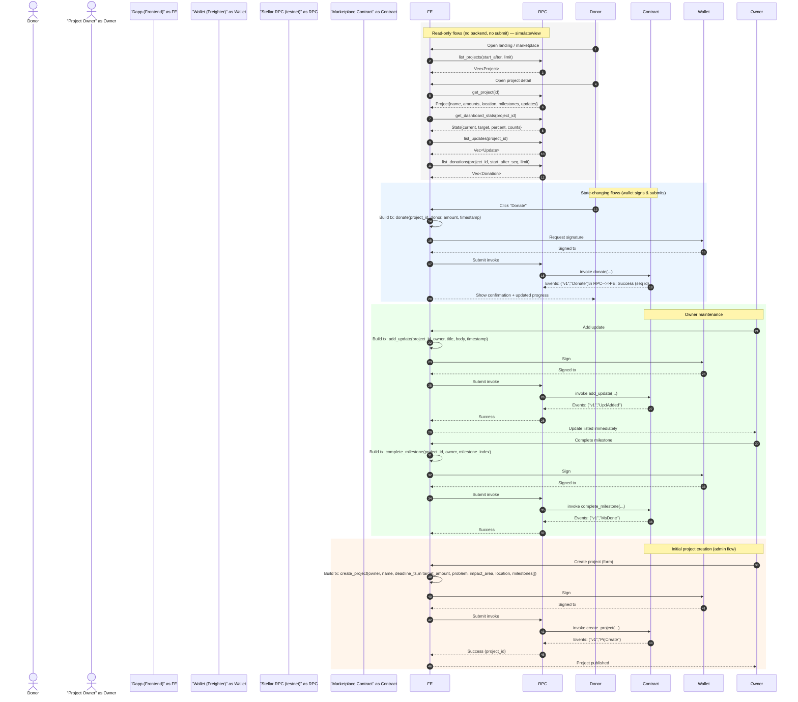

# Frontend ↔ Contract flows (no backend)

```mermaid
sequenceDiagram
    autonumber
    actor "Donor" as Donor
    actor "Project Owner" as Owner
    participant "Dapp (Frontend)" as FE
    participant "Wallet (Freighter)" as Wallet
    participant "Stellar RPC (testnet)" as RPC
    participant "Marketplace Contract" as Contract

    rect rgb(245,245,245)
      Note over FE,RPC: Read-only flows (no backend, no submit) — simulate/view
      Donor->>FE: Open landing / marketplace
      FE->>RPC: list_projects(start_after, limit)
      RPC-->>FE: Vec<Project>
      Donor->>FE: Open project detail
      FE->>RPC: get_project(id)
      RPC-->>FE: Project{name, amounts, location, milestones, updates}
      FE->>RPC: get_dashboard_stats(project_id)
      RPC-->>FE: Stats{current, target, percent, counts}
      FE->>RPC: list_updates(project_id)
      RPC-->>FE: Vec<Update>
      FE->>RPC: list_donations(project_id, start_after_seq, limit)
      RPC-->>FE: Vec<Donation>
    end

    rect rgb(235,245,255)
      Note over Donor,Contract: State-changing flows (wallet signs & submits)
      Donor->>FE: Click "Donate"
      FE->>FE: Build tx: donate(project_id, donor, amount, timestamp)
      FE->>Wallet: Request signature
      Wallet-->>FE: Signed tx
      FE->>RPC: Submit invoke
      RPC->>Contract: invoke donate(...)
      Contract-->>RPC: Events: ("v1","Donate")\n      RPC-->>FE: Success (seq id)
      FE-->>Donor: Show confirmation + updated progress
    end

    rect rgb(235,255,235)
      Note over Owner,Contract: Owner maintenance
      Owner->>FE: Add update
      FE->>FE: Build tx: add_update(project_id, owner, title, body, timestamp)
      FE->>Wallet: Sign
      Wallet-->>FE: Signed tx
      FE->>RPC: Submit invoke
      RPC->>Contract: invoke add_update(...)
      Contract-->>RPC: Events: ("v1","UpdAdded")
      RPC-->>FE: Success
      FE-->>Owner: Update listed immediately

      Owner->>FE: Complete milestone
      FE->>FE: Build tx: complete_milestone(project_id, owner, milestone_index)
      FE->>Wallet: Sign
      Wallet-->>FE: Signed tx
      FE->>RPC: Submit invoke
      RPC->>Contract: invoke complete_milestone(...)
      Contract-->>RPC: Events: ("v1","MsDone")
      RPC-->>FE: Success
    end

    rect rgb(255,245,235)
      Note over Owner,Contract: Initial project creation (admin flow)
      Owner->>FE: Create project (form)
      FE->>FE: Build tx: create_project(owner, name, deadline_ts,\n        target_amount, problem, impact_area, location, milestones[])
      FE->>Wallet: Sign
      Wallet-->>FE: Signed tx
      FE->>RPC: Submit invoke
      RPC->>Contract: invoke create_project(...)
      Contract-->>RPC: Events: ("v1","PrjCreate")
      RPC-->>FE: Success (project_id)
      FE-->>Owner: Project published
    end
```
